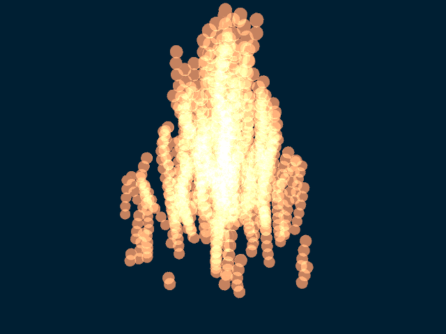
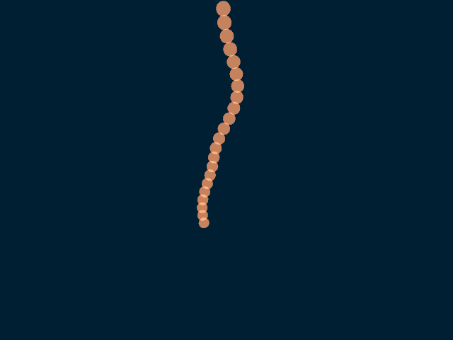

# Extension: Fire



### Author: Martin Vasina

### Category: Solid

### Namespace: MartinVasina

### Class name: Fire : DefaultSceneNode, ISolid, ITimeDependent

### ITimeDependent: Yes

### Source file: Fire.cs

Toto rozsireni implementuje simulaci ohne jako nove teleso (ISolid).

Simulace ohne je provedena tak, ze:
1) Do kruhove zakladny ohne je nahodne nagenerovano urcite mnozstvi castic
2) Casticim v zakladne je prirazen lifetime podle vzdalenosti od stredu
3) Dale se opakuji simulacni kroky na novem seznamu castic:
    4) Vsem casticim se snizi lifetime o 1 
    5) Odstrani se mrtve castice
    6) Provede se update kazde castice (pricte se vektor rychlosti k poloze)
    7) Do seznamu je nakopirovana zakladna castic

Castice ohne tedy tvori sloupce, na ktere je aplikovana sumova funkce.



Uzivatel definuje polohu ohne (stred) a polomer zakladny ohne.


## Example

From a scene/animation definition script
```
using MartinVasina;

...

Fire fire = new Fire(new Vector3d(0, 0, 0), 1.5);
root.InsertChild(fire, Matrix4d.Identity);
```

Zde je vektor `(0,0,0)` pozice stredu zakladny ohne a `1.5` je polomer zakladny ohne.

### Sample animation script: FireScene.cs


